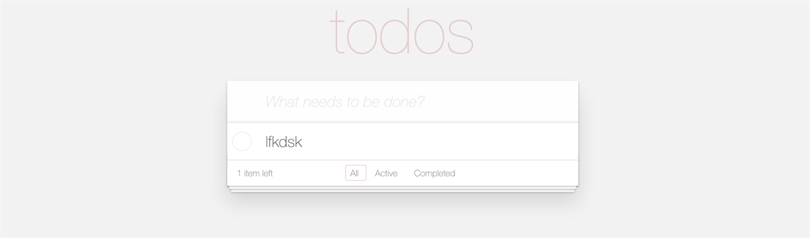

# Django Todo-List Demo



## install

``` shell
git clone git@github.com:lfkdsk/django-todo.git
```

## run

* activate virtual env

``` shell
virtualenv env
source env/bin/activate
```

* install requirement

``` shell
pip install -r requirement
```

* run server

``` shell
python manage.py migrate
python manage.py runserver 0:8003
```

